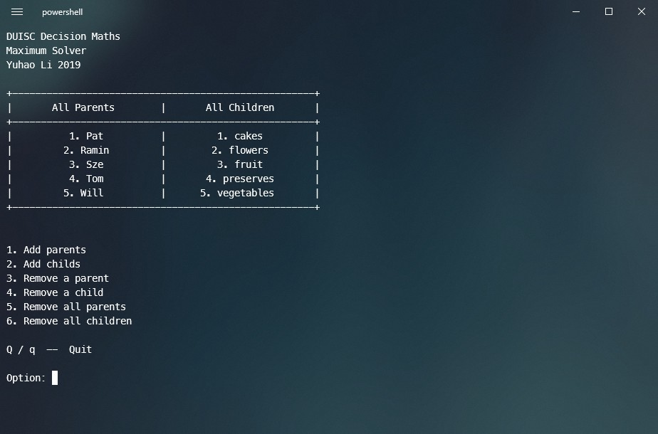
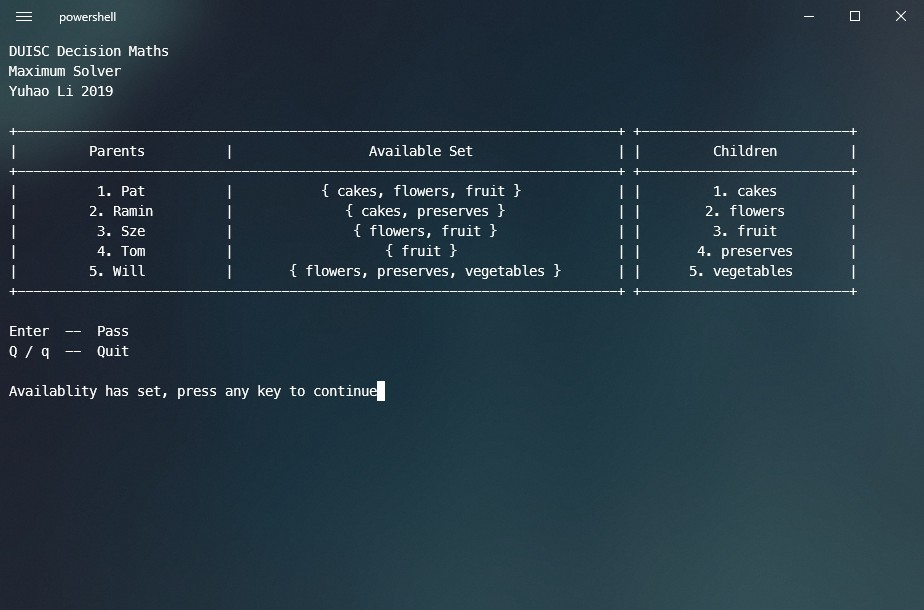
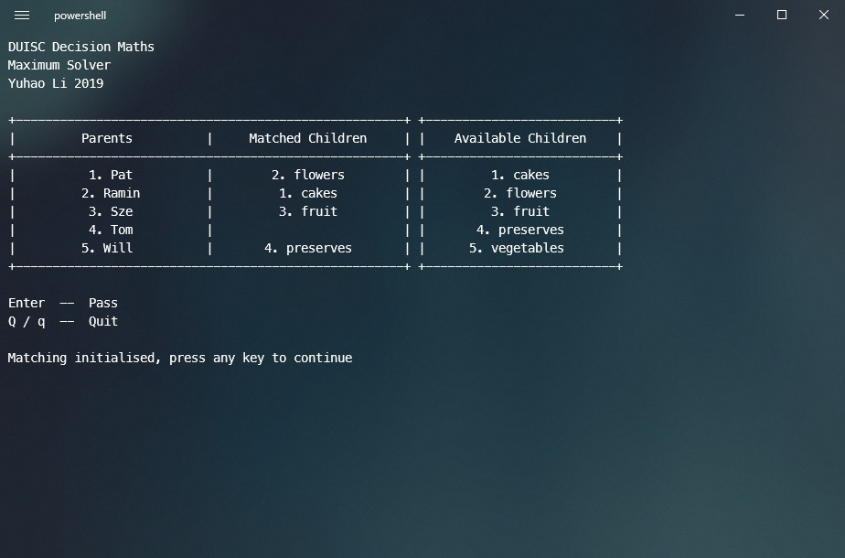
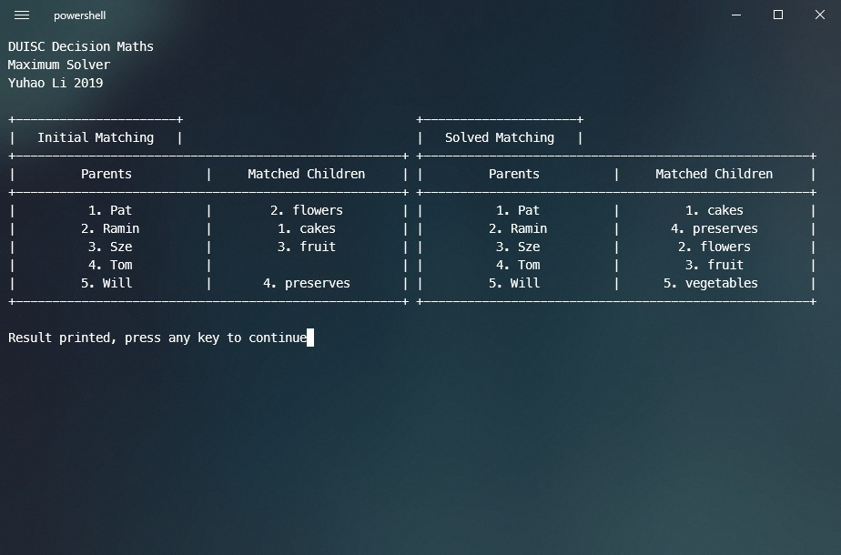

# Bipartite Matchings Algorithm
## Introduction
An maximum_matching algorithm for bipartite graphs. 

## Usage
1. Execute the "Main.py".

2. Type "1" to set up the parent/child nodes. You may use "," to seperate names of the node when adding.

3. Type "2" to set up the availablities for the parent nodes. You may use "," to seperate indexs of the node when setting.

4. Type "3" to set up the initial matching graph.

5. Type "4" to calculate and print the result.
